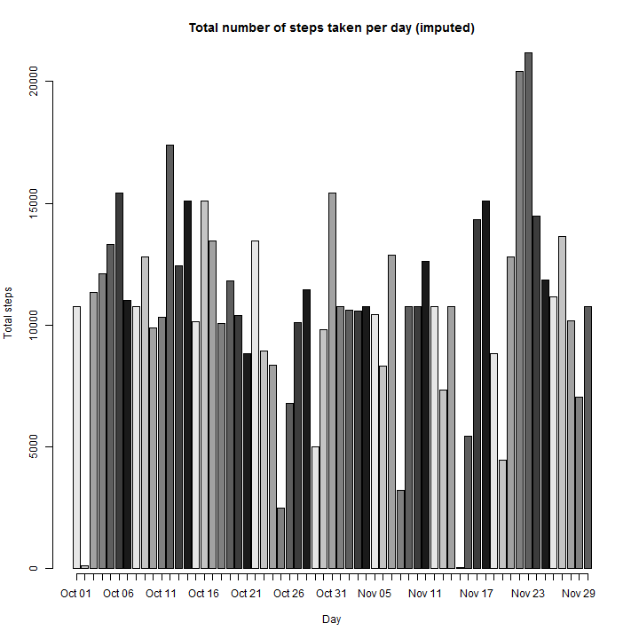

# Reproducible Research: Peer Assessment 1


## Loading and preprocessing the data


```r
library(knitr)
library(ggplot2)
library(reshape2)
library(xtable)

unzip("activity.zip")
activity <- read.csv("activity.csv", colClasses=c("numeric", "Date", "numeric"))
act.na.rm <- activity[!is.na(activity$steps),]

#tick markers and their labels. Used for plots
days.at <- seq(min(activity$date), max(activity$date), by=7)
days.at.int <- as.numeric(days.at) - as.numeric(min(days.at))
days.lab <- as.character(days.at, format="%b %d")

int.at <- seq(0,2400, by=300)
int.lab <- as.character(strptime(sprintf("%04d", int.at), format="%H%M"),
                        format="%I%p")
```

## What is mean total number of steps taken per day?

Here is the histogram of total number of steps taken per day

```r
act.sum <- tapply(act.na.rm$steps, act.na.rm$date, sum)

#labels for this barplot
days.at.1 <- as.Date(labels(act.sum)[[1]], format="%Y-%m-%d")
days.lab.1 <- as.character(days.at.1, format="%b %d")

barplot(act.sum, 
        names.arg=days.lab.1, axis.lty=1,
        col=grey(seq(0.9, 0.1, length.out=7)),
        xlab="Day", ylab="Total steps",
        main="Total number of steps taken per day")
```

 

Here are the tables of mean and median of total number of steps taken per day

```r
act.means <- tapply(act.na.rm$steps, act.na.rm$date, mean)
act.means <- melt(act.means)
names(act.means) <- c("date", "steps")
act.means
```

```
##          date   steps
## 1  2012-10-02  0.4375
## 2  2012-10-03 39.4167
## 3  2012-10-04 42.0694
## 4  2012-10-05 46.1597
## 5  2012-10-06 53.5417
## 6  2012-10-07 38.2465
## 7  2012-10-09 44.4826
## 8  2012-10-10 34.3750
## 9  2012-10-11 35.7778
## 10 2012-10-12 60.3542
## 11 2012-10-13 43.1458
## 12 2012-10-14 52.4236
## 13 2012-10-15 35.2049
## 14 2012-10-16 52.3750
## 15 2012-10-17 46.7083
## 16 2012-10-18 34.9167
## 17 2012-10-19 41.0729
## 18 2012-10-20 36.0938
## 19 2012-10-21 30.6285
## 20 2012-10-22 46.7361
## 21 2012-10-23 30.9653
## 22 2012-10-24 29.0104
## 23 2012-10-25  8.6528
## 24 2012-10-26 23.5347
## 25 2012-10-27 35.1354
## 26 2012-10-28 39.7847
## 27 2012-10-29 17.4236
## 28 2012-10-30 34.0938
## 29 2012-10-31 53.5208
## 30 2012-11-02 36.8056
## 31 2012-11-03 36.7049
## 32 2012-11-05 36.2465
## 33 2012-11-06 28.9375
## 34 2012-11-07 44.7326
## 35 2012-11-08 11.1771
## 36 2012-11-11 43.7778
## 37 2012-11-12 37.3785
## 38 2012-11-13 25.4722
## 39 2012-11-15  0.1424
## 40 2012-11-16 18.8924
## 41 2012-11-17 49.7882
## 42 2012-11-18 52.4653
## 43 2012-11-19 30.6979
## 44 2012-11-20 15.5278
## 45 2012-11-21 44.3993
## 46 2012-11-22 70.9271
## 47 2012-11-23 73.5903
## 48 2012-11-24 50.2708
## 49 2012-11-25 41.0903
## 50 2012-11-26 38.7569
## 51 2012-11-27 47.3819
## 52 2012-11-28 35.3576
## 53 2012-11-29 24.4688
```

```r
act.median <- tapply(act.na.rm$steps, act.na.rm$date, median)
act.median <- melt(act.median)
names(act.median) <- c("date", "steps")
act.median
```

```
##          date steps
## 1  2012-10-02     0
## 2  2012-10-03     0
## 3  2012-10-04     0
## 4  2012-10-05     0
## 5  2012-10-06     0
## 6  2012-10-07     0
## 7  2012-10-09     0
## 8  2012-10-10     0
## 9  2012-10-11     0
## 10 2012-10-12     0
## 11 2012-10-13     0
## 12 2012-10-14     0
## 13 2012-10-15     0
## 14 2012-10-16     0
## 15 2012-10-17     0
## 16 2012-10-18     0
## 17 2012-10-19     0
## 18 2012-10-20     0
## 19 2012-10-21     0
## 20 2012-10-22     0
## 21 2012-10-23     0
## 22 2012-10-24     0
## 23 2012-10-25     0
## 24 2012-10-26     0
## 25 2012-10-27     0
## 26 2012-10-28     0
## 27 2012-10-29     0
## 28 2012-10-30     0
## 29 2012-10-31     0
## 30 2012-11-02     0
## 31 2012-11-03     0
## 32 2012-11-05     0
## 33 2012-11-06     0
## 34 2012-11-07     0
## 35 2012-11-08     0
## 36 2012-11-11     0
## 37 2012-11-12     0
## 38 2012-11-13     0
## 39 2012-11-15     0
## 40 2012-11-16     0
## 41 2012-11-17     0
## 42 2012-11-18     0
## 43 2012-11-19     0
## 44 2012-11-20     0
## 45 2012-11-21     0
## 46 2012-11-22     0
## 47 2012-11-23     0
## 48 2012-11-24     0
## 49 2012-11-25     0
## 50 2012-11-26     0
## 51 2012-11-27     0
## 52 2012-11-28     0
## 53 2012-11-29     0
```

## What is the average daily activity pattern?

```r
act.pat <- tapply(act.na.rm$steps, act.na.rm$interval, mean)

act.pat.melt <- melt(act.pat)
names(act.pat.melt) <- c("interval", "steps.mean")

#getting the max point and creating its label
max.pt <- order(act.pat.melt$steps.mean, decreasing=TRUE)[1]
max.pt <- act.pat.melt[max.pt,]
max.pt.lab <- "label"
max.pt.lab <- paste(round(max.pt$steps.mean, 2), "@", 
                    as.character(strptime(sprintf("%04d", max.pt$interval), 
                                          format="%H%M"),
                                 format="%I:%M%p"))
                    
plot(act.pat.melt$interval, act.pat.melt$steps.mean, type="l", xaxt="n",
     xlab="Time", ylab="Average number of steps",
     main="Average daily activity pattern")
axis(1, at=int.at, labels=int.lab, cex.axis=0.8)
points(max.pt$interval, max.pt$steps.mean, col="red", pch=16)
text(max.pt$interval, max.pt$steps.mean, max.pt.lab, pos=4, col="red")
```

 

## Imputing missing values

There are **2304 NA values** in activity.csv. Imputing those with the mean of interval column  

Here is the histogram of imputed total number of steps taken per day


```r
act.na <- activity[is.na(activity),]

#reusing act.pat.melt from previous block
act.na.imp <- merge(act.na, act.pat.melt, by.x="interval", by.y="interval")
act.imp <- act.na.imp[, c("steps.mean","date","interval")]

names(act.imp) <- c("steps", "date", "interval")
act.imp <- rbind(act.na.rm, act.imp)

#getting the sum for each day
act.imp.sum <- tapply(act.imp$steps, act.imp$date, sum)

#labels for this barplot
days.at.1 <- seq(min(act.imp$date), max(act.imp$date), by=1)
days.lab.1 <- as.character(days.at.1, format="%b %d")

barplot(act.imp.sum, 
        names.arg=days.lab.1, axis.lty=1,
        col=grey(seq(0.9, 0.1, length.out=7)),
        xlab="Day", ylab="Total steps",
        main="Total number of steps taken per day (imputed)")
```

 

Here are the tables of mean and median of imputed total number of steps taken per day


```r
act.imp.means <- tapply(act.imp$steps, act.imp$date, mean)
act.imp.means <- melt(act.imp.means)
names(act.imp.means) <- c("date", "steps")
act.imp.means
```

```
##          date   steps
## 1  2012-10-01 37.3826
## 2  2012-10-02  0.4375
## 3  2012-10-03 39.4167
## 4  2012-10-04 42.0694
## 5  2012-10-05 46.1597
## 6  2012-10-06 53.5417
## 7  2012-10-07 38.2465
## 8  2012-10-08 37.3826
## 9  2012-10-09 44.4826
## 10 2012-10-10 34.3750
## 11 2012-10-11 35.7778
## 12 2012-10-12 60.3542
## 13 2012-10-13 43.1458
## 14 2012-10-14 52.4236
## 15 2012-10-15 35.2049
## 16 2012-10-16 52.3750
## 17 2012-10-17 46.7083
## 18 2012-10-18 34.9167
## 19 2012-10-19 41.0729
## 20 2012-10-20 36.0938
## 21 2012-10-21 30.6285
## 22 2012-10-22 46.7361
## 23 2012-10-23 30.9653
## 24 2012-10-24 29.0104
## 25 2012-10-25  8.6528
## 26 2012-10-26 23.5347
## 27 2012-10-27 35.1354
## 28 2012-10-28 39.7847
## 29 2012-10-29 17.4236
## 30 2012-10-30 34.0938
## 31 2012-10-31 53.5208
## 32 2012-11-01 37.3826
## 33 2012-11-02 36.8056
## 34 2012-11-03 36.7049
## 35 2012-11-04 37.3826
## 36 2012-11-05 36.2465
## 37 2012-11-06 28.9375
## 38 2012-11-07 44.7326
## 39 2012-11-08 11.1771
## 40 2012-11-09 37.3826
## 41 2012-11-10 37.3826
## 42 2012-11-11 43.7778
## 43 2012-11-12 37.3785
## 44 2012-11-13 25.4722
## 45 2012-11-14 37.3826
## 46 2012-11-15  0.1424
## 47 2012-11-16 18.8924
## 48 2012-11-17 49.7882
## 49 2012-11-18 52.4653
## 50 2012-11-19 30.6979
## 51 2012-11-20 15.5278
## 52 2012-11-21 44.3993
## 53 2012-11-22 70.9271
## 54 2012-11-23 73.5903
## 55 2012-11-24 50.2708
## 56 2012-11-25 41.0903
## 57 2012-11-26 38.7569
## 58 2012-11-27 47.3819
## 59 2012-11-28 35.3576
## 60 2012-11-29 24.4688
## 61 2012-11-30 37.3826
```

```r
act.imp.median <- tapply(act.imp$steps, act.imp$date, median)
act.imp.median <- melt(act.imp.median)
names(act.imp.median) <- c("date", "steps")
act.imp.median
```

```
##          date steps
## 1  2012-10-01 34.11
## 2  2012-10-02  0.00
## 3  2012-10-03  0.00
## 4  2012-10-04  0.00
## 5  2012-10-05  0.00
## 6  2012-10-06  0.00
## 7  2012-10-07  0.00
## 8  2012-10-08 34.11
## 9  2012-10-09  0.00
## 10 2012-10-10  0.00
## 11 2012-10-11  0.00
## 12 2012-10-12  0.00
## 13 2012-10-13  0.00
## 14 2012-10-14  0.00
## 15 2012-10-15  0.00
## 16 2012-10-16  0.00
## 17 2012-10-17  0.00
## 18 2012-10-18  0.00
## 19 2012-10-19  0.00
## 20 2012-10-20  0.00
## 21 2012-10-21  0.00
## 22 2012-10-22  0.00
## 23 2012-10-23  0.00
## 24 2012-10-24  0.00
## 25 2012-10-25  0.00
## 26 2012-10-26  0.00
## 27 2012-10-27  0.00
## 28 2012-10-28  0.00
## 29 2012-10-29  0.00
## 30 2012-10-30  0.00
## 31 2012-10-31  0.00
## 32 2012-11-01 34.11
## 33 2012-11-02  0.00
## 34 2012-11-03  0.00
## 35 2012-11-04 34.11
## 36 2012-11-05  0.00
## 37 2012-11-06  0.00
## 38 2012-11-07  0.00
## 39 2012-11-08  0.00
## 40 2012-11-09 34.11
## 41 2012-11-10 34.11
## 42 2012-11-11  0.00
## 43 2012-11-12  0.00
## 44 2012-11-13  0.00
## 45 2012-11-14 34.11
## 46 2012-11-15  0.00
## 47 2012-11-16  0.00
## 48 2012-11-17  0.00
## 49 2012-11-18  0.00
## 50 2012-11-19  0.00
## 51 2012-11-20  0.00
## 52 2012-11-21  0.00
## 53 2012-11-22  0.00
## 54 2012-11-23  0.00
## 55 2012-11-24  0.00
## 56 2012-11-25  0.00
## 57 2012-11-26  0.00
## 58 2012-11-27  0.00
## 59 2012-11-28  0.00
## 60 2012-11-29  0.00
## 61 2012-11-30 34.11
```


## Are there differences in activity patterns between weekdays and weekends?

```r
#adding at new factor variable to indicate if the day is weekday or weekend
act.imp$day <- weekdays(as.Date(act.imp$date, format="%Y-%m-%d"), TRUE)
act.imp$weekend <- act.imp$day %in% c("Sat","Sun")
act.imp$day.type <- factor(act.imp$weekend, labels=c("Weekday", "Weekend"))

#plot the graph with facets for weekday and weekend
qp.mean <- qplot(interval, steps, data=act.imp, facets=day.type ~ ., 
                stat="summary", fun.y="mean", geom="line",
                ylab="Average steps per 5 minute interval", xlab="Time",
                main="Activity pattern comparision of weekday and weekend") + 
                scale_x_continuous(breaks = int.at,labels = int.lab)
qp.mean
```

 
